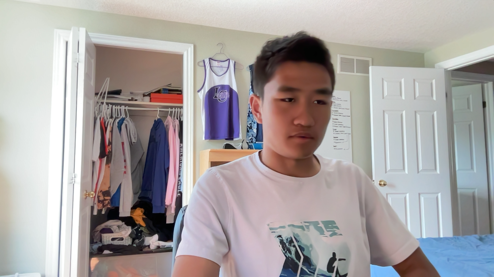

# StrongArm - A Robotic Arm Project
A Software Engineering Design Project for ICS4UI.
Project By Sean W, Daniel E, Robert X and Steven M

### What is it? 

StrongArm is an ambitious project that combines hardware and software. The inspiration for this project came when we saw how inefficient modern-day ship yards are. In order to load a ship, multiple workers have to manually operate very complex machines, which are expensive, hard to maintain and dangerous. Not to mention, the amount of human errors that can occur is mind-boggling. You often see containers delivered to wrong locations due to human errors.  Because of this, companies have to spend more money getting everything fixed while the customer is getting angry because their shipment is delayed once again. What if there’s a better way to do this through the use of technology? That’s where we came up with the idea for StrongArm.

The StrongArm platform is built to be a simulation for the actual shipyard. Essentially, we have a camera that checks where a container is. Then, the user is able to move the container wherever they want using our simple and super intuitive UI. This command then gets sent to our hardware component, which physically moves the boxes without any workers. This process can be repeated to sort all the boxes. This process can also be automated, but we do not plan to implement that feature at the current stage of development. 

### How To Use

Lorem ipsum dolor sit amet, consectetur adipiscing elit, sed do eiusmod tempor incididunt ut labore et dolore magna aliqua. Ut enim ad minim veniam, quis nostrud exercitation ullamco laboris nisi ut aliquip ex ea commodo consequat. Duis aute irure dolor in reprehenderit in voluptate velit esse cillum dolore eu fugiat nulla pariatur. Excepteur sint occaecat cupidatat non proident, sunt in culpa qui officia deserunt mollit anim id est laborum.

### What was used? (Tech Stack)

Lorem ipsum dolor sit amet, consectetur adipiscing elit, sed do eiusmod tempor incididunt ut labore et dolore magna aliqua. Ut enim ad minim veniam, quis nostrud exercitation ullamco laboris nisi ut aliquip ex ea commodo consequat. Duis aute irure dolor in reprehenderit in voluptate velit esse cillum dolore eu fugiat nulla pariatur. Excepteur sint occaecat cupidatat non proident, sunt in culpa qui officia deserunt mollit anim id est laborum.

### what needs to be done
robert: user manual
daniel: front end functions (setttings, make look better)
sean, steven: hardware
